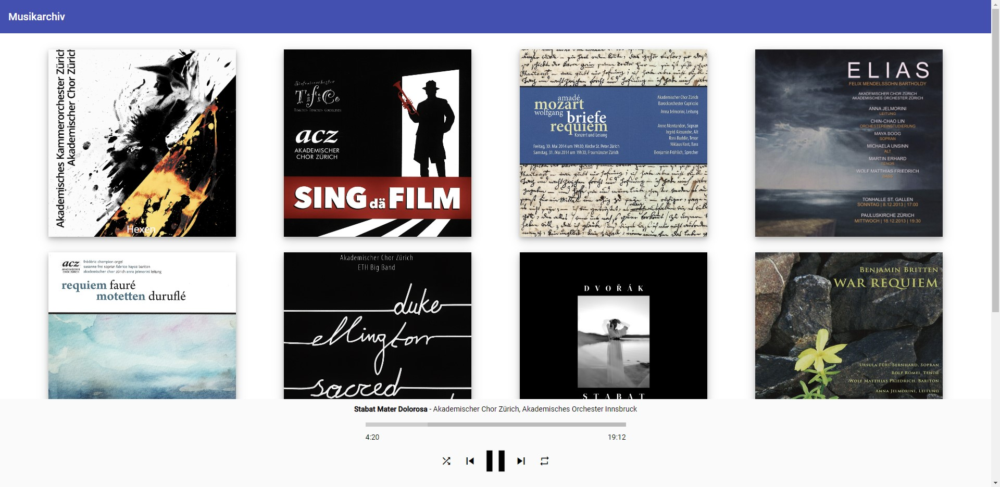

# Musikarchiv

A small Angular web application which can show and play collection of static music albums (mp3s). It's designed to work entirely with static assets, so you can run it on any web server like Apache, IIS or Nginx (or any hosting provider). The goal of this application is to enable you to host a private online gallery of your own music on the web, allowing access control using Basic Auth (or potentially other authorization methods).  

Here is a screenshot of it in action on a private collection:

<p style="text-align:center; padding-bottom:30px">
    
</p>

# Overview

The solution consits of a frontend app (Angular, single-page) and a backend nodejs script which indexes (and potentially serves) the mp3 files. 
The frontend is an Angular app written in TypeScript, which needs to built in order to be served it in a browser. Both the backend script and the frontend's (Angular) build/serve system are entirely based on node.js. 

The backend crawls a specified audio library folder for mp3 files (ogg/acc/flac etc. are discouraged, as not all browser support this), and extracts their metadata into a JSON string (called *catalog*).  

# Getting Started

1. Make Sure node-js is installed.

2. Create a mp3 library folder somewhere on your computer: 
    - Place each album's mp3s into its own subfolder
    - Add an image file for each album subfolder, named cover.png (or .jpg or .gif). This is mandatory, otherwise the gallery will not work.

3. Open up the backend `catalogist.js` script and adjust this variable accordingly:
```javascript
const musicFolder = "C:/path-to-my/music/collection"; // absolute or relative path
```

4. Run `npm start` in the backend folder. This will index the mp3s in the specified music folder and extract the metadata into a JSON string. In the default (development) setting, the script will also start an express webserver and serve this JSON on localhost:3000 as http://localhost:3000/index.json. (It's also written out to a local file named `index.json` per default.)

5. In another command shell, start the frontend with the commands mentioned before (in the `frontend` folder):
 - `npm install`
 - `ng serve`

 6. You should now be able to view your albums in the app in http://localhost:4200

 # Deplyoing on a webserver

Per default, the backend `catalogist.js` script saves the found JSON metadata (including the paths to the individual mp3s) in a file named `index.json` in the backend folder. To run this on a webserver you will need to adjust the `hostname` constant so that it matches an absolute or relative URL pointing to your mp3 folder as it is served by the webserver. (If it's relative, it needs to be relative to where the frontend app). If you have a remote webserver with shell access, you can run the `catalogist.js` script on there directly and place the `index.json` file in the mp3 or frontend folder. (The default Express webserver part serving on localhost:3000 is only intended for development purposes). If you do not have shell access, you can mirror the folder and file structure, so that your local mp3 folder and the one on the remote web server match exactly (i.e. the paths within the folder are the same), and then run the script locally. You can then upload the index.json to the remote web server as if it was generated there.

To build the frontend for production, run `ng build --configuration=production`. This will create a minified, optimized version (saved in the `dist` subfolder), which you can just copy paste on your webserver (e.g. nginx, apache, IIS). You should review the `environment.prod.ts` to match your your target installation (which differ from the development settings you get with `ng serve`). In particular, the path to the index.json file discussed in the section before will have to be adjusted.

# Authorization

Currently, the app has a rudimentary *HTTP Basic Authentication* support. It can be disabled entirely by setting the `authEnabled` variables in `environment.ts` and `catalogist.js` to *false*. 

Unfortuantely, with the current solution it is not possible to keep the entire library in a location requiring authentication for each request (i.e. to just enable Basic Auth the mp3 library folder). This works with most browsers, but not with Safari. Safari does not automatically request/attach the Basic Auth headers when the `src` of `<audio>` objects is filled dynamically through JavaScript. In short that means that your mp3s will have to be unprotected if you want to access the library with a Mac or iOS. (This could be solved by making all requests XHttpRequests in the future)

So the rudimentary solution is to just protect the `index.json` file with Basic Authentication. The frontend app asks for the credentials and tries to access this file to test if the credentials work - and that's it. By not being able to list the mp3s (and by denying directory listing) essentially they're hidden from the public. 

This is a main area where the app can be extended and improved, also with respect to other, more secure authorization methods (e.g. token based).
